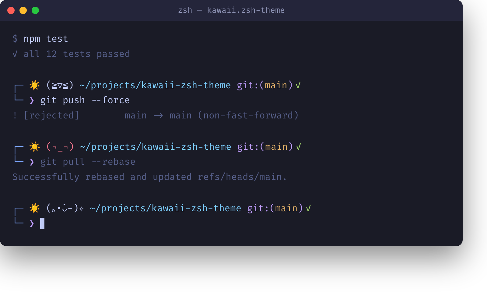

# kawaii-zsh-theme

A tiny terminal creature with feelings. `kawaii.zsh-theme` reacts to your
last command's exit status, knows what time it is, and shows a random
kaomoji that never repeats twice in a row.



## Features

- 😊 **Happy** kaomoji after a successful command, 😡 **angry** ones after
  a failed one.
- 😴 Switches to sleepy kaomoji during your configured bedtime hours.
- 🌅☀️🌇🌙 A sky icon that changes with the time of day.
- The kaomoji never shows the same face twice in a row, even across a
  mood change (success → failure → success won't repeat the last face).
- Git branch + dirty/clean status via oh-my-zsh's `git` plugin.

## Requirements

- [oh-my-zsh](https://github.com/ohmyzsh/ohmyzsh)
- The `git` plugin enabled in your `.zshrc` (provides `git_prompt_info`,
  used for the `git:(branch ✓)` segment):

  ```zsh
  plugins=(git)
  ```

## Install

Clone this repo into your oh-my-zsh custom themes directory:

```zsh
git clone https://github.com/tetibear-ish/kawaii-zsh-theme.git \
  "${ZSH_CUSTOM:-$HOME/.oh-my-zsh/custom}/themes/kawaii-zsh-theme"

ln -s "${ZSH_CUSTOM:-$HOME/.oh-my-zsh/custom}/themes/kawaii-zsh-theme/kawaii.zsh-theme" \
  "${ZSH_CUSTOM:-$HOME/.oh-my-zsh/custom}/themes/kawaii.zsh-theme"
```

Or just grab the single file:

```zsh
curl -fsSL https://raw.githubusercontent.com/tetibear-ish/kawaii-zsh-theme/master/kawaii.zsh-theme \
  -o "${ZSH_CUSTOM:-$HOME/.oh-my-zsh/custom}/themes/kawaii.zsh-theme"
```

Then set the theme in `.zshrc`:

```zsh
ZSH_THEME="kawaii"
```

Restart your shell (or `exec zsh`) and you're done.

## Configuration

Set these in `.zshrc` **before** oh-my-zsh loads the theme:

| Variable            | Default | Meaning                          |
| ------------------- | ------- | --------------------------------- |
| `KAWAII_BEDTIME`    | `22:30` | Start of sleepy-face hours (HH:MM) |
| `KAWAII_WAKE_TIME`  | `06:00` | End of sleepy-face hours (HH:MM)   |

```zsh
KAWAII_BEDTIME="23:00"
KAWAII_WAKE_TIME="07:30"
ZSH_THEME="kawaii"
```
